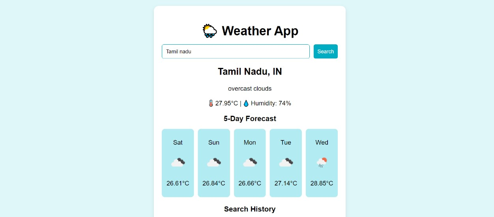

# 🌦️ Simple Weather Forecast App — `just-weather`

A clean, responsive web application that displays the **current weather** and **5-day forecast** for any city. Built using **HTML**, **CSS**, and **JavaScript**, with live data from the **OpenWeatherMap API**.

---

## ✅ Features

- 🔍 City weather search
- 📆 5-Day forecast (12:00 PM each day)
- 💾 Search history (up to 5 recent cities)
- ⚡ Clickable history for quick reload
- 📱 Responsive & clean UI
- 🧼 Auto-clears old history after 5 entries

---

## 📸 Screenshot

 <!-- Replace with your actual screenshot if needed -->

---

## 🔧 Tech Stack

- HTML5
- CSS3
- JavaScript 
- OpenWeatherMap API
